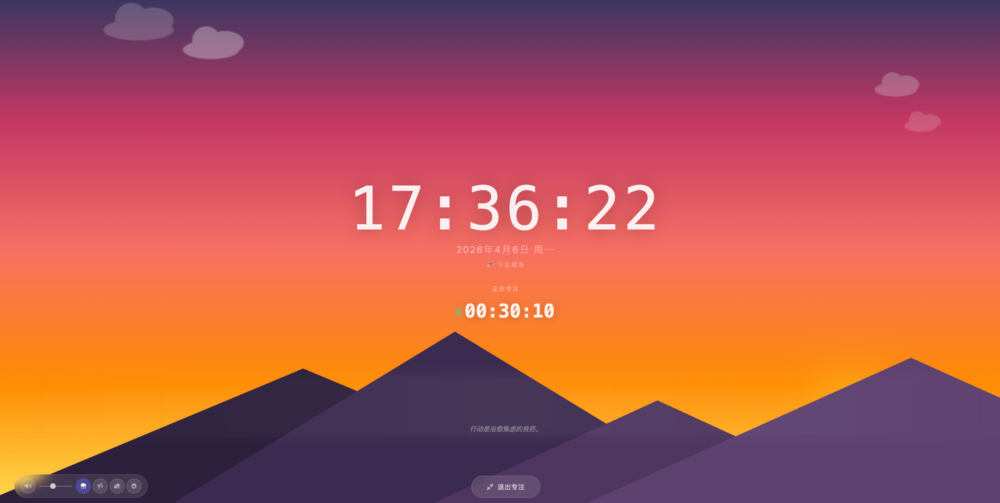

# Daily Tracker 🎯

一个**单文件**的每日效率追踪小工具。不用注册，不用安装，下载一个 HTML 文件，浏览器打开就能用。

**👉 [在线体验](https://junfei-z.github.io/diary/)**

---

## 快速开始

1. 下载 [`index.html`](./index.html)
2. 用浏览器打开（Chrome / Edge / Safari 都行）
3. 开始你的高效一天！

就这么简单。需要联网（加载样式），但所有数据都存在你自己的浏览器里，不传任何服务器。

> ⚠️ **数据保存提醒**：你的所有数据存在浏览器的 LocalStorage 里。**不要清除浏览器缓存/浏览数据**，否则记录会丢失。建议定期用页面底部的「导出」功能备份数据。

---

## 功能介绍

### ⏱️ 专注计时

点「开始专注」就开始计时，结束后自动记录这段时间。页面上会实时显示你今天专注了多久，每段专注的起止时间都有记录。

### 🌅 四段式时间管理

一天被分成四个时段，每个时段有自己的风格：

| 时段 | 时间 | 风格 |
|------|------|------|
| 早起卷王 | 06:00 - 12:00 | 🌅 晨间冲刺 |
| 午后续命 | 12:00 - 18:00 | ☀️ 稳定输出 |
| 挑灯夜战 | 18:00 - 23:00 | 🌙 夜间深耕 |
| 修仙时刻 | 23:00 - 06:00 | 🌌 肝帝模式 |

专注只能在当前时段开始，时段切换时会自动停止计时。

### ✅ 任务管理

- 添加今天要做的任务
- 点时钟按钮可以把专注时段分配给具体任务
- 完成后打勾，统计今日完成数量
- 每个任务的专注时间都会在时间轴上用不同颜色显示

### 📊 任务时间轴

24 小时可视化时间轴，分成四个时段。已分配给任务的时间用任务对应的颜色显示，未分配的用灰色（通用专注）。红色竖线标注当前时刻。一眼看清今天的时间都花在哪了。

### 🧘 禅修模式

全屏沉浸式专注体验，帮你彻底进入心流状态：

- **自然白噪音**：内置雨声、篝火、森林、麦田风声等多种环境音效，用 Web Audio API 实时生成，不依赖外部音频文件
- **跟随时间变化的天空**：背景会根据你当前所处的时段自动切换 — 清晨是柔和的日出，午后是温暖的落日余晖，夜晚是深邃的星空，每个时段都有独特的山景和云朵动画
- **专注计时同步**：禅修模式下计时器持续运行，退出即自动停止专注，时段切换也会自动退出

### ⚡ 闪念记录

脑子里突然冒出的想法？打开「闪念」区域，快速记下来，带时间戳。不打断你的专注节奏，回头再整理。

### 📅 日历 & 周报

- 日历高亮显示有记录的日子，点击查看当日详情
- 周报摘要卡片：近 7 天活跃热力图、最佳专注时段、任务完成率、活跃天数
- 连续打卡天数自动统计

### 😊 心情记录

每天记录一下心情（开心 / 平静 / 低落），可以加备注。回头看看自己的心情曲线。

### 🌐 双语切换

支持中文和英文，右上角一键切换。

---

## 数据安全

- **纯本地存储**：所有数据都在浏览器的 LocalStorage 里，不会发送到任何服务器
- **导出备份**：点页面底部「导出」按钮，把数据保存为 JSON 文件
- **导入恢复**：换电脑或换浏览器时，用「导入」功能恢复数据
- **注意**：清除浏览器缓存会丢失数据！养成定期导出的好习惯

---

## 技术栈

单个 HTML 文件，零依赖部署：

- [Tailwind CSS](https://tailwindcss.com/) — 样式
- [Font Awesome](https://fontawesome.com/) — 图标
- 原生 JavaScript — 无框架
- LocalStorage — 数据持久化
- Web Audio API — 禅修环境音效

---

## 开源协议

MIT License — 随便用，随便改。

如果觉得好用，给个 ⭐ 就是最大的支持！
